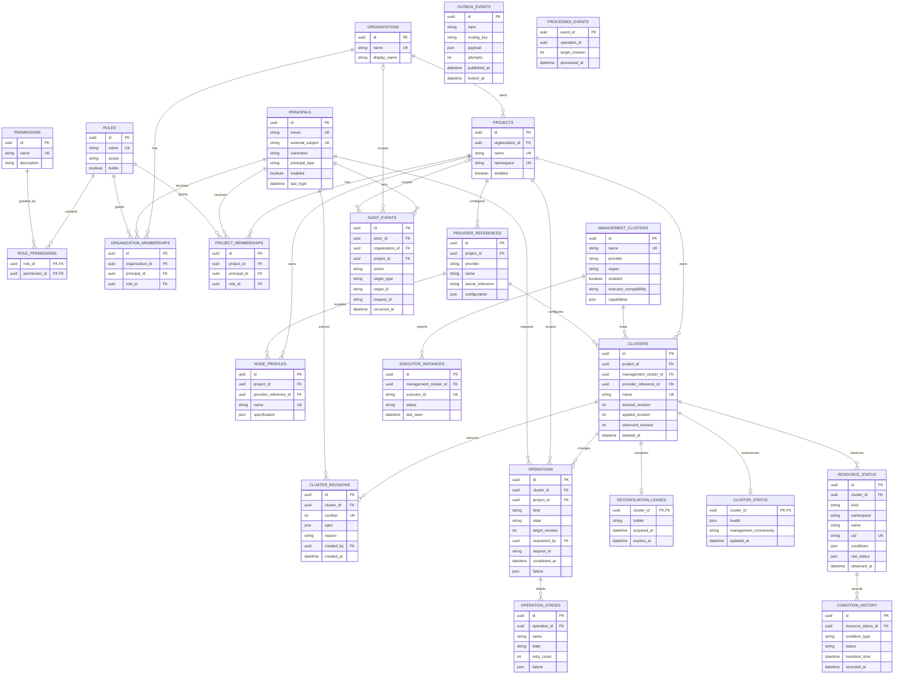
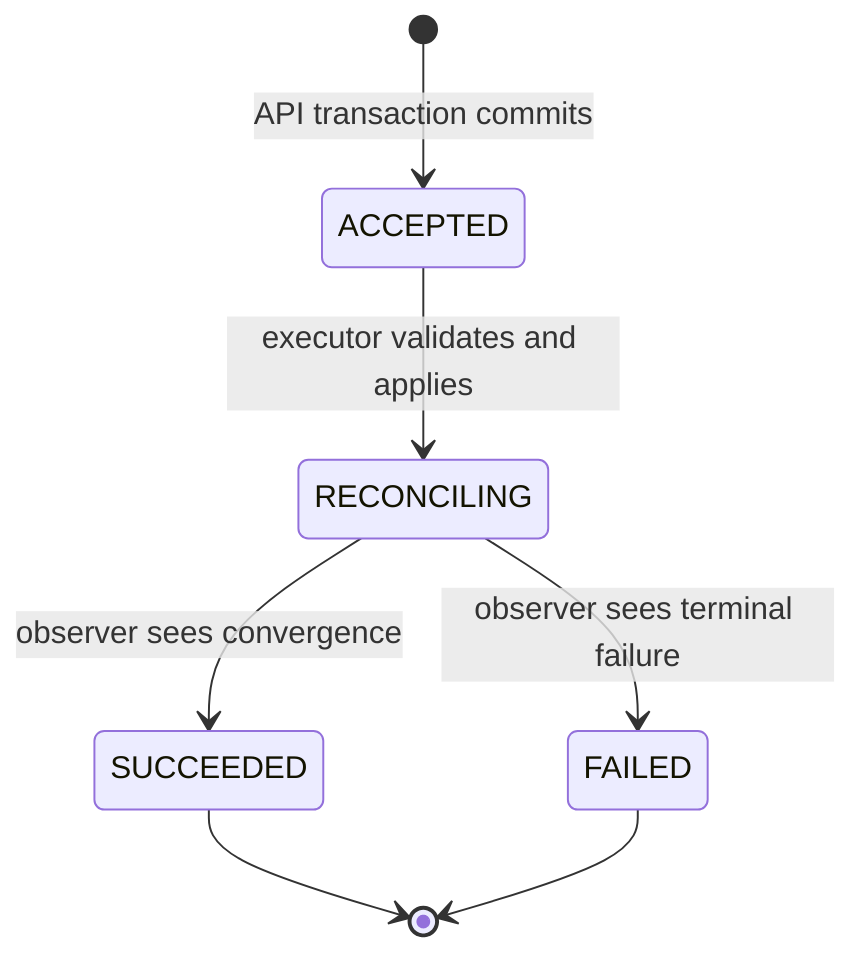

# Database schema and frontend status guide

This document is the maintainable database reference for the control plane. It explains
the PostgreSQL schema, important fields and relationships, where each table is used in
Python, and how a frontend can follow asynchronous work. Read the root
[README](../../README.md) first for the system architecture and the
[code walkthrough](../code-walkthrough/README.md) for module ownership.

## Sources of truth and update workflow

The diagram below is Mermaid source, not an exported image. GitHub and other Mermaid
renderers turn it into a UML-style entity relationship diagram while keeping the model
reviewable in the repository.

Keep these artifacts aligned when the schema changes:

1. Change the SQLAlchemy mapping in
   [`infrastructure/database.py`](../../src/platform_service/infrastructure/database.py).
2. Generate and review a new Alembic revision. Never edit an already deployed revision
   and never create tables during application startup.
3. Update the entity diagram, table notes, and code map in this document.
4. Update the Pydantic transport model in
   [`api/schemas.py`](../../src/platform_service/api/schemas.py) only when the field is
   part of the public HTTP contract.
5. Add migration and behavior tests, then run the repository checks documented in the
   root README.

`infrastructure/database.py` is the current mapping source. The initial migration builds
from its version-pinned metadata; later changes must be explicit Alembic migrations.
PostgreSQL is authoritative for platform state, but it is not a time-series metrics
store and it does not contain management-cluster kubeconfigs or raw provider secrets.

## Entity relationship diagram

An arrow represents a database foreign key unless the relationship is labelled
**logical** in the notes after the diagram. `PK` means primary key, `FK` means foreign
key, and `UK` means a unique key or part of a unique constraint. Optional columns are
marked in the detailed table reference rather than overloading this overview.



### Logical links not enforced by foreign keys

These deliberate application-level links do not appear as diagram arrows:

- `operations.target_revision` identifies `cluster_revisions.number` for the same
  `cluster_id`. The executor checks that it exactly equals `clusters.desired_revision`
  before applying anything.
- `clusters.desired_revision`, `applied_revision`, and `observed_revision` are pointers
  into that cluster's revision numbers. They are three independent lifecycle facts.
- `outbox_events.payload` contains `event_id`, `operation_id`, `cluster_id`, `project_id`,
  `target_revision`, and `kind`. JSON keeps the durable transport envelope independent
  of the relational entities.
- `processed_events.event_id` corresponds to the outbox event ID, and its
  `operation_id` corresponds to an operation. These fields intentionally have no
  foreign keys so the consumer's idempotency receipt remains a transport boundary.
- `audit_events.target_id` is a string because an audit target can be any entity type;
  interpret it together with `target_type`.

## Important parameters by area

All entity IDs are UUIDs. `created_at`, `updated_at`, `observed_at`, `occurred_at`, and
lease timestamps are timezone-aware. Fields described as optional map to nullable
columns; other listed fields are required unless a database/application default is
noted.

### Identity, tenancy, and authorization

See the [IAM guide](../iam/README.md) for the runtime authentication flow, scoped role
inheritance, supported administration endpoints, and current limitations.

| Table | Important parameters and constraints | Meaning |
|---|---|---|
| `principals` | Unique `(issuer, external_subject)`; optional `username`, `display_name`, `email`; `principal_type`; `enabled`; `first_seen`; `last_login` | Maps a validated external OIDC subject to a local identity. The API never stores passwords or bearer tokens. |
| `organizations` | Unique `name`; `display_name`; creation/update timestamps | Top-level tenant container. |
| `projects` | `organization_id`; unique `(organization_id, name)`; globally unique `namespace`; `enabled` | Authorization and workload namespace boundary. Disabling a project prevents supported mutations/membership use. |
| `roles` | Unique `name`; `scope`; `builtin` | Named grant bundle. The service validates project versus organization scope when assigning it. |
| `permissions` | Unique `name`; optional `description` | Atomic capability such as `cluster.read` or `cluster.scale`. |
| `role_permissions` | Composite primary key `(role_id, permission_id)` | Many-to-many role grant join. |
| `organization_memberships` | Unique `(organization_id, principal_id, role_id)` | Organization-level role assignment inherited by its projects. |
| `project_memberships` | Unique `(project_id, principal_id, role_id)` | Direct project role assignment. Effective permissions are the union of direct and inherited grants. |

### Placement and desired state

| Table | Important parameters and constraints | Meaning |
|---|---|---|
| `provider_references` | `project_id`; `provider`; `name`; opaque `secret_reference`; JSON `configuration` | Project-scoped, non-secret provider settings. Only a reference to credentials is stored. |
| `node_profiles` | `project_id`; `provider_reference_id`; unique `(project_id, name)`; JSON `specification` | Reusable provider machine settings such as image/flavor intent. |
| `management_clusters` | Unique `name`; `provider`; `region`; `enabled`; `executor_compatibility`; JSON `capabilities` | Routing and compatibility metadata for an execution target, never a kubeconfig. |
| `clusters` | Unique `(project_id, name)`; placement foreign keys; three revision pointers; optional `deleted_at` | Stable cluster identity and current lifecycle pointers. A non-null `deleted_at` is a tombstone. |
| `cluster_revisions` | Unique `(cluster_id, number)`; JSON `spec`; `reason`; `created_by`; `created_at` | Immutable desired-state history. Scale and upgrade append rather than overwrite. |

The most important cluster fields are:

- `desired_revision`: newest user intent accepted by the API.
- `applied_revision`: exact revision accepted by the management adapter. It may lag
  desired state while queued or reconciling.
- `observed_revision`: exact revision the observer saw converge. It may lag applied
  state and is not itself a health value.
- `provider_reference_id`: selects provider configuration and a secret **reference**;
  it must never lead to credentials being returned by the API.

`cluster_revisions.spec` stores the serialized provider-neutral `ClusterSpec`. Its
important nested keys are `kubernetes.version`, network CIDRs and DNS servers,
`control_plane`, `worker_node_types`, autoscaling bounds, machine-health-check policy,
features, addons, and addon strategy. Validation and defaults live in
`domain/spec.py`; provider translation lives in `infrastructure/compiler.py`.

### Asynchronous operations, delivery, and serialization

| Table | Important parameters and constraints | Meaning |
|---|---|---|
| `operations` | `cluster_id`; duplicated `project_id` tenant scope; `kind`; indexed `state`; `target_revision`; `requested_by`; `request_id`; optional `completed_at` and JSON `failure` | Frontend-visible history of a requested action. It is not current cluster health. |
| `operation_stages` | `operation_id`; `name`; `state`; start/end times; optional reason/message/resource/failure; `retry_count` | Detailed stage progress. The table exists, but the current public `OperationView` does not expose stages. |
| `outbox_events` | `topic`; `routing_key`; JSON `payload`; attempt/error fields; publish and claim fields | Post-commit delivery intent. `published_at = null` means publication is not confirmed. |
| `processed_events` | `event_id`; `operation_id`; `target_revision`; `processed_at` | Consumer-side receipt that makes an at-least-once command idempotent. |
| `reconciliation_leases` | One row per `cluster_id`; `holder`; `acquired_at`; indexed `expires_at` | Prevents two executor replicas from mutating one cluster concurrently without globally serializing different clusters. |

The implemented operation progression is:



`ACCEPTED` and `RECONCILING` are non-terminal. `SUCCEEDED` and `FAILED` are terminal in
the current implementation. The target architecture also discusses states such as
`DISPATCHED`, cancellation, timeout, and supersession; do not make a frontend depend on
those until their runnable transitions are implemented.

### Observation, audit, and executors

| Table | Important parameters and constraints | Meaning |
|---|---|---|
| `cluster_status` | One row per cluster; JSON `health`; `management_connectivity`; `updated_at` | Latest normalized UI/API projection. It is independent of operation history. |
| `resource_status` | `cluster_id`; resource identity; globally unique `uid`; generations/version; JSON `conditions` and `raw_status`; `observed_at` | Latest raw-ish CAPI/CAPO resource snapshot, not an append-only timeline. |
| `condition_history` | `resource_status_id`; condition type/status/reason/message; generation; transition/record times | Append-oriented condition transitions. The fake observer currently records only the initial transition. |
| `executor_instances` | `management_cluster_id`; unique `executor_id`; component versions; `status`; indexed `last_seen` | Executor inventory and heartbeat. Executor presence is not cluster health. |
| `audit_events` | Actor and optional organization/project scope; action; polymorphic target; request/revision/result fields; source IP; JSON details | Security and lifecycle audit trail. Mutation services write it in the same transaction as the intent. |

Normalized `cluster_status.health` currently contains `infrastructure`, `control_plane`,
`workers`, `machines`, `availability`, `scaling`, `rolling_out`, `remediating`,
`deleting`, and `paused`. Consumers should tolerate additional keys as normalization
evolves. `resource_status.conditions` and `raw_status` retain provider details for
diagnostics; they should not be confused with the normalized projection.

## Mapping tables to code

| Concern | Write path | Read path / public mapping |
|---|---|---|
| Principal mapping, tenant metadata, and permissions | `infrastructure/auth.py`, `application/iam_service.py`, `application/admin_service.py`, `infrastructure/bootstrap.py` | Administration/IAM routes in `api/routes.py`; safe response models in `api/schemas.py` omit external identity keys and provider secret references |
| Cluster and immutable revisions | `application/cluster_service.py` | Cluster/revision routes in `api/routes.py`; `ClusterView` plus the validated models in `domain/spec.py` |
| Operation, audit, and outbox intent | `ClusterService._intent()` in `application/cluster_service.py` | Operation routes in `api/routes.py`; `OperationView` in `api/schemas.py` |
| Outbox claims and publication | `workers/outbox.py` | Operational logs/metrics; no public outbox API |
| Idempotency, leases, and applied revision | `application/reconciliation.py` | Internal only; the cluster API exposes `applied_revision` |
| Resource snapshots, conditions, normalized health, observed revision, and terminal operations | `workers/fake_observer.py` locally; a production observer must honor the same contracts | Health, resource, condition, cluster, and operation routes in `api/routes.py` |
| Executor heartbeat | `workers/heartbeat.py` | No public executor inventory endpoint currently |
| Physical schema | `infrastructure/database.py` and `alembic/versions/*` | Adminer/SQL tooling for operators, never direct frontend access |

Only `Cluster.revisions` / `ClusterRevision.cluster` currently has an explicit
SQLAlchemy ORM `relationship()`. Other associations are intentionally loaded with
explicit queries and foreign-key values. A database foreign key therefore does not
imply that a convenient ORM property exists.

## Frontend polling: follow an executed task

Cluster create, full-spec update, worker-node-type changes, scale, upgrade, and delete
return HTTP `202 Accepted` with an `OperationView`. Save its `id`, then poll this
endpoint with the same bearer token:

```http
GET /v1/operations/{operation_id}
Authorization: Bearer <access-token>
```

This is the preferred endpoint for following one submitted action. It requires
`cluster.read` on the operation's cluster and returns `404` for an unknown operation.
The response currently contains:

```json
{
  "id": "7aab2bde-1548-4454-bdc8-467932736c97",
  "cluster_id": "d06a864a-57b3-4a9b-abf2-4b6248e76aec",
  "kind": "CREATE",
  "state": "RECONCILING",
  "target_revision": 1,
  "created_at": "2026-09-16T12:00:00Z",
  "completed_at": null,
  "failure": null
}
```

Stop polling when `state` is `SUCCEEDED` or `FAILED`. Polling the operation answers
whether that particular request finished; it does **not** answer whether the cluster is
healthy now. After success, refresh these read models as appropriate:

- `GET /v1/clusters/{cluster_id}` for desired/applied/observed revision pointers;
- `GET /v1/clusters/{cluster_id}/health` for current normalized health;
- `GET /v1/clusters/{cluster_id}/resources` for observed resources; and
- `GET /v1/clusters/{cluster_id}/conditions` for current resource conditions.

Use `GET /v1/clusters/{cluster_id}/operations` when a screen needs recent operation
history rather than one known request. It returns newest first, but is not currently
paginated. Do not poll `/healthz`: it reports only API-process liveness, not a cluster or
operation state. Flower is a local operator UI for Celery transport tasks; its task IDs
are not the stable, tenant-authorized frontend contract.

### Browser example

This dependency-free example starts with the operation returned by the mutation. It
uses moderate backoff, stops cleanly, and lets the caller cancel when the component is
unmounted. Production UI code should also coordinate token refresh in its OIDC client.

```javascript
const TERMINAL_STATES = new Set(["SUCCEEDED", "FAILED"]);

export async function pollOperation({
  apiBaseUrl,
  operationId,
  accessToken,
  onUpdate,
  signal,
}) {
  let delayMs = 1_000;

  while (!signal?.aborted) {
    const response = await fetch(
      `${apiBaseUrl}/v1/operations/${encodeURIComponent(operationId)}`,
      {
        headers: {Authorization: `Bearer ${accessToken}`},
        signal,
      },
    );

    if (!response.ok) {
      throw new Error(`Operation poll failed with HTTP ${response.status}`);
    }

    const operation = await response.json();
    onUpdate(operation);

    if (TERMINAL_STATES.has(operation.state)) {
      return operation;
    }

    await new Promise((resolve, reject) => {
      const timer = setTimeout(resolve, delayMs);
      signal?.addEventListener(
        "abort",
        () => {
          clearTimeout(timer);
          reject(signal.reason ?? new DOMException("Aborted", "AbortError"));
        },
        {once: true},
      );
    });
    delayMs = Math.min(Math.round(delayMs * 1.5), 5_000);
  }

  throw signal?.reason ?? new DOMException("Aborted", "AbortError");
}
```

Recommended UI behavior:

1. Render `ACCEPTED` as queued/accepted and `RECONCILING` as in progress.
2. Disable only conflicting controls for that cluster, not the whole application.
3. Stop on terminal state, then invalidate cluster, health, resource, and operation-list
   queries so the page updates without a browser refresh.
4. Cancel the timer when navigating away. Pause or slow polling when the tab is hidden.
5. Treat `401` as a token-refresh/login concern, `403` as lost authorization, and `404`
   as a missing/stale operation ID. Retry transient network errors and `5xx` responses
   with capped backoff and jitter rather than creating a new mutation.
6. Preserve and display the mutation's `X-Request-ID` in support diagnostics. Repeating
   a mutation just because a poll failed can create another valid revision/operation.

`OperationView` includes `completed_at` and the structured `failure` when available, so
a frontend can explain a terminal result without direct database access. The more
detailed `operation_stages` records are not yet exposed through the public API.
