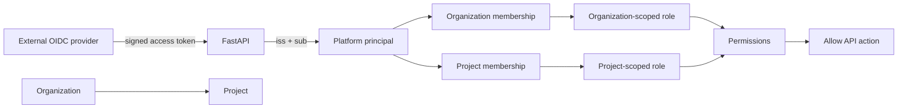
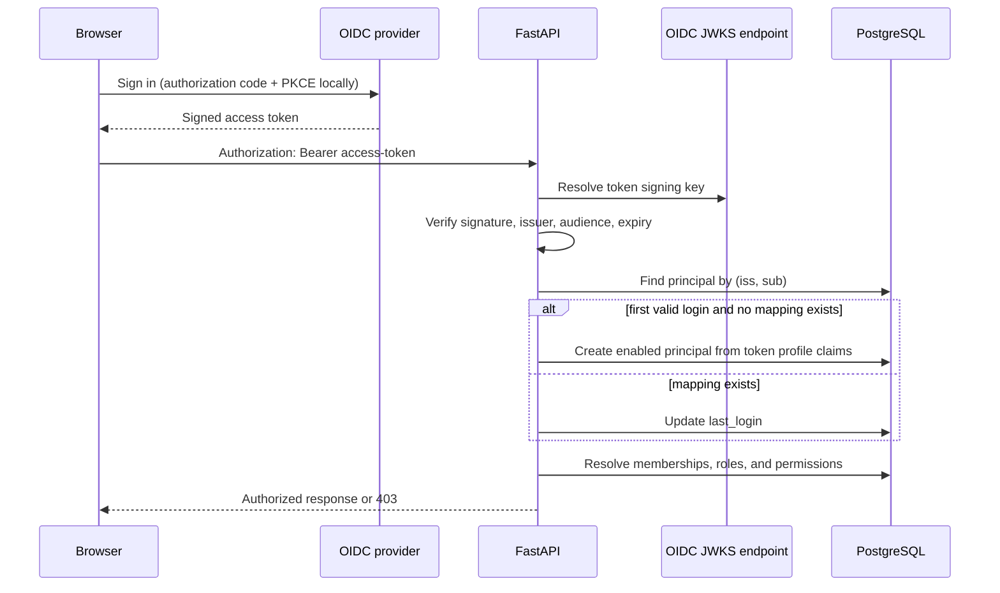

# Identity, tenancy, and authorization

This guide explains the IAM model that is implemented today: how an OIDC identity
becomes a platform principal, how organization and project roles grant permissions,
which administration APIs exist, and which capabilities remain intentionally absent.

The platform IAM database authorizes control-plane APIs. It does **not** create
Kubernetes users or ServiceAccounts, and it does not replace the external identity
provider. Keycloak is the local OIDC provider; another standards-compliant provider can
be configured in production.

## Mental model



The important concepts are:

| Concept | Purpose |
|---|---|
| **OIDC provider** | Authenticates a human and signs the access token. Passwords stay with this provider. |
| **Principal** | Local identity record keyed by the unique `(issuer, external_subject)` pair from token claims. |
| **Organization** | Top-level tenant and parent of projects. |
| **Project** | Primary resource-ownership and authorization boundary. A project also maps to one workload namespace. |
| **Role** | Named bundle of permissions with either `organization` or `project` scope. |
| **Membership** | Assigns one scoped role to a principal in an organization or project. A principal may have several memberships. |
| **Permission** | Atomic capability checked by an API, such as `cluster.read` or `cluster.delete`. |

Authentication answers **who is calling**. Authorization separately answers **whether
that principal has the permission required for this tenant and action**.

## Authentication flow



`current_identity()` requires a bearer token and verifies:

- a trusted signing key obtained from the configured JWKS endpoint;
- the configured issuer (`iss`);
- the API audience (`aud`);
- token expiry; and
- required `exp`, `iss`, and `sub` claims.

The stable identity key is `(iss, sub)`. `preferred_username`, `name`, and `email` are
copied only as profile metadata; they are not authorization keys. On a successful
request, the platform updates `last_login`.

If a validated `(iss, sub)` has no principal, the current implementation automatically
creates an enabled principal. This is **just-in-time principal mapping**, not automatic
tenant access: the new principal has no organization/project membership and therefore
cannot use project APIs until an administrator assigns a role. Pre-provisioning through
the administration API is also supported, so a membership can exist before first login.

Pre-provisioning must currently happen before that identity's first just-in-time login.
The create endpoint returns `409` when the `(iss, sub)` mapping already exists, and there
is not yet a separate API for attaching an organization membership to an existing
principal. This is a known administration gap rather than an implicit allow-list policy.

Disabling a principal causes later authenticated requests to return `403`, even when
the external token is still valid. `PLATFORM_AUTH_DISABLED` is not a public bypass:
when enabled, the public authentication dependency returns `503` rather than trusting
an anonymous caller.

### Tokens and credentials that are not stored

The platform never stores:

- an identity-provider password;
- a bearer or refresh token;
- a Keycloak client secret in browser configuration; or
- a management-cluster kubeconfig as part of IAM.

`POST /organizations/{organization_id}/principals` creates only the platform mapping
for an identity that exists (or will exist) at the configured provider. It does not call
Keycloak and does not create a login password.

## Authorization flow

Every protected route resolves permissions on the server. Hiding a button in a frontend
is useful user experience, but it is never an authorization boundary.

### Project permissions

For a project, effective permissions are the union of:

1. permissions granted by the principal's direct **project memberships**; and
2. permissions granted by the principal's **organization memberships** for the
   organization that owns the project.

In set notation:

```text
effective(project) = direct_project_grants(project)
                   ∪ inherited_organization_grants(project.organization)
```

Role scope is checked during resolution:

- only a `project` role contributes through `project_memberships`;
- only an `organization` role contributes through `organization_memberships`;
- an organization role is inherited by every project in that organization; and
- a project role never becomes organization-wide.

Possessing a role in organization A gives no access to organization B. Likewise, a
direct role in project A gives no access to another project, even when both projects
belong to the same organization.

### Organization administration permissions

Organization administration resolves only organization-scoped memberships for the
requested organization. The current administration APIs use the existing
`project.admin` permission as their administrative capability. A direct project-admin
role does not grant organization-wide administration.

### Typical request decision

```text
request
  -> validate OIDC token
  -> resolve local principal
  -> load target project/organization
  -> calculate scoped permission set
  -> require the endpoint's permission
       allowed: call application service
       denied:  return 403
```

Cluster lookup and permission checking are combined so a caller cannot operate on a
cluster merely by discovering its UUID. Application services repeat important mutation
checks so authorization is not represented only by frontend behavior.

## Built-in local roles and permissions

The bootstrap process creates these permissions:

| Permission | Intended capability |
|---|---|
| `cluster.create` | Create a cluster. |
| `cluster.read` | Read clusters, operations, health, resources, and project catalog data needed by cluster forms. |
| `cluster.update` | Replace desired state and add, replace, or remove worker node types. |
| `cluster.scale` | Change worker replicas. |
| `cluster.upgrade` | Change the Kubernetes version. |
| `cluster.delete` | Request asynchronous cluster deletion. |
| `provider.configure` | Manage provider references and node profiles. |
| `project.admin` | Administer tenant metadata, roles, and project membership at the applicable scope. |
| `audit.read` | Reserved for an authorized audit-read API, which is not implemented yet. |

The local roles are:

| Role | Scope | Grants |
|---|---|---|
| `local-project-viewer` | project | `cluster.read` |
| `local-project-operator` | project | `cluster.create`, `cluster.read`, `cluster.scale`, `cluster.upgrade` |
| `local-project-admin` | project | All locally seeded permissions |
| `local-organization-admin` | organization | All locally seeded permissions, inherited by projects in that organization |

These are bootstrap defaults for the reference stack, not a claim that every production
deployment must use the same policy. Roles and permissions are stored relationally so a
future administration surface can support a different policy without changing cluster
domain models.

## Currently supported IAM APIs

All paths below are under `/v1` and require a valid access token.

### Identity and visibility

| Method and path | Required access | Result |
|---|---|---|
| `GET /principals/me` | authenticated | Safe profile of the current principal. Does not return `issuer` or `external_subject`. |
| `GET /organizations` | authenticated | Organizations where the caller has an organization membership. |
| `GET /projects` | authenticated | Enabled projects visible through a direct project membership or inherited organization membership. |

### Organization administration

| Method and path | Required access | Result |
|---|---|---|
| `GET /organizations/{organization_id}/roles` | organization `project.admin` | Organization-scoped roles and their grants. |
| `GET /organizations/{organization_id}/principals` | organization `project.admin` | Deduplicated principals with a membership in the organization. |
| `POST /organizations/{organization_id}/principals` | organization `project.admin` | Create an OIDC principal mapping and its initial organization-role membership (`201`). |
| `PATCH /organizations/{organization_id}/principals/{principal_id}` | organization `project.admin` | Update profile metadata or enable/disable a principal that belongs to that organization. |
| `GET /organizations/{organization_id}/projects` | organization `project.admin` | List enabled and disabled projects owned by the organization. |
| `POST /organizations/{organization_id}/projects` | organization `project.admin` | Create an enabled project and namespace mapping (`201`). |

### Project administration

| Method and path | Required access | Result |
|---|---|---|
| `PATCH /projects/{project_id}` | effective `project.admin` | Update project name or enabled state. Empty/null-only patches are rejected. |
| `GET /projects/{project_id}/roles` | effective `project.admin` | Project-scoped roles and their grants. |
| `GET /projects/{project_id}/members` | effective `project.admin` | Direct project-role assignments with safe principal details. |
| `POST /projects/{project_id}/members` | effective `project.admin` | Assign one project role to an enabled principal (`201`). |
| `DELETE /projects/{project_id}/members/{principal_id}/roles/{role_id}` | effective `project.admin` | Remove one exact project-role assignment (`204`). |

Project administrators can assign only project-scoped roles. The service rejects a
disabled/missing project, a disabled/missing principal, an organization-scoped role,
and a duplicate assignment.

Provider-reference and node-profile endpoints use the same persisted IAM system but are
documented with the cluster APIs. Reads require `cluster.read`; writes require
`provider.configure`. Provider-reference responses omit the stored secret reference.

## Administration examples

The examples assume `TOKEN`, `PLATFORM_URL`, and the relevant IDs are already set. Use
the root README's local login instructions to obtain the development token.

### Discover an organization role

```bash
curl -fsS \
  -H "Authorization: Bearer $TOKEN" \
  "$PLATFORM_URL/v1/organizations/$ORGANIZATION_ID/roles"
```

Use an organization-scoped role ID in the next request. A project-scoped role is
intentionally rejected.

### Pre-provision an external principal

```bash
curl -fsS -X POST \
  -H "Authorization: Bearer $TOKEN" \
  -H 'content-type: application/json' \
  -H 'X-Request-ID: provision-alice-1' \
  "$PLATFORM_URL/v1/organizations/$ORGANIZATION_ID/principals" \
  -d "{
    \"issuer\": \"$OIDC_ISSUER\",
    \"external_subject\": \"the-stable-sub-claim-from-the-idp\",
    \"role_id\": \"$ORGANIZATION_ROLE_ID\",
    \"username\": \"alice\",
    \"display_name\": \"Alice Example\",
    \"email\": \"alice@example.test\"
  }"
```

The external subject must be the stable OIDC `sub`, not a username or email address.
The operation is synchronous because it is a short PostgreSQL transaction; success
returns `201`, not an asynchronous Celery operation.

### Create a project

```bash
curl -fsS -X POST \
  -H "Authorization: Bearer $TOKEN" \
  -H 'content-type: application/json' \
  -H 'X-Request-ID: create-project-1' \
  "$PLATFORM_URL/v1/organizations/$ORGANIZATION_ID/projects" \
  -d '{"name":"research","namespace":"p-research"}'
```

The namespace must be a DNS-compatible, globally unique value. The creating
organization administrator automatically sees the project through inherited access;
the API does not add a redundant direct project membership.

### Assign a project role

First read `/projects/{project_id}/roles`, then assign one returned role:

```bash
curl -fsS -X POST \
  -H "Authorization: Bearer $TOKEN" \
  -H 'content-type: application/json' \
  -H 'X-Request-ID: assign-alice-viewer-1' \
  "$PLATFORM_URL/v1/projects/$PROJECT_ID/members" \
  -d "{\"principal_id\":\"$PRINCIPAL_ID\",\"role_id\":\"$PROJECT_ROLE_ID\"}"
```

Membership creation and removal are synchronous and commit their audit event in the
same transaction.

## Auditing and security behavior

Supported IAM mutations write an `audit_events` row with the actor, tenant scope,
action, target, request ID, source IP when available, result, and action-specific
details. In particular:

- principal provisioning records the initial organization role ID;
- principal/project updates record the fields changed; and
- project membership changes record the affected role ID.

Supply `X-Request-ID` from the client when correlation with UI/support activity is
useful. The API generates one when it is absent.

Public principal responses omit the `(issuer, external_subject)` identity mapping key.
This reduces unnecessary identifier exposure; administrators provide those values only
when provisioning. Authorization is always recalculated from persisted memberships and
role grants rather than copied from editable username/email fields or trusted from UI
state.

## HTTP errors

| Status | IAM meaning |
|---|---|
| `201` | Principal mapping, project, or membership created. |
| `204` | Exact project membership removed. |
| `401` | Missing, invalid, expired, wrongly issued, or wrongly addressed access token. |
| `403` | Principal disabled or required scoped permission absent. |
| `404` | Tenant-scoped principal, project, organization role, or membership not found. |
| `409` | Duplicate principal/membership/project or another business conflict. |
| `422` | Request body or path value failed transport validation. |

The API deliberately avoids accepting a user-supplied permission list. Administrators
assign a persisted role; the role's stored grants determine effective permissions.

## Current limitations

The following are not implemented yet and should not be inferred from the schema:

- creating, updating, or deleting an identity-provider account in Keycloak;
- password reset, MFA enrollment, account recovery, or token revocation;
- dedicated service-principal issuance and client-credential lifecycle;
- role CRUD, permission CRUD, or changing a role's grants through the API;
- adding/removing an organization membership independently of initial principal
  provisioning (including attaching one after just-in-time principal creation);
- deleting principals, organizations, or projects (projects can currently be disabled);
- an authorized audit-event read/export API;
- rejected-attempt audit records and a production audit retention/export policy;
- frontend permission-summary endpoint beyond role and membership reads;
- production IdP configuration/runbooks and automated key-rotation integration tests;
- row-level security in PostgreSQL (tenant isolation is currently enforced in the API
  and application query paths); and
- full repository-port adapters—the current IAM services still query SQLAlchemy
  directly.

The local Keycloak realm, users, credentials, wildcard development client settings, and
HTTP URLs are development conveniences. Use exact HTTPS origins, production client
policy, secret management, and a production identity-provider lifecycle outside the
local stack.

## Code map

| Concern | Implementation |
|---|---|
| Token verification and principal JIT mapping | `src/platform_service/infrastructure/auth.py` |
| Project/organization permission queries | `src/platform_service/infrastructure/auth.py` |
| Project membership and role reads | `src/platform_service/application/iam_service.py` |
| Principal/project administration | `src/platform_service/application/admin_service.py` |
| HTTP routes and tenant checks | `src/platform_service/api/routes.py` |
| Safe request/response models | `src/platform_service/api/schemas.py` |
| IAM tables | `src/platform_service/infrastructure/database.py` |
| Local built-in roles and grants | `src/platform_service/infrastructure/bootstrap.py` |
| Local OIDC realm and clients | `dev/keycloak/realm.json` |
| IAM tests | `tests/test_iam.py`, `tests/test_admin_service.py`, `tests/test_local_stack.py` |

When adding an IAM endpoint, keep the route thin, resolve the narrowest tenant scope,
put mutation and audit behavior in an application service, return only safe transport
models, and add positive and cross-tenant denial tests.
